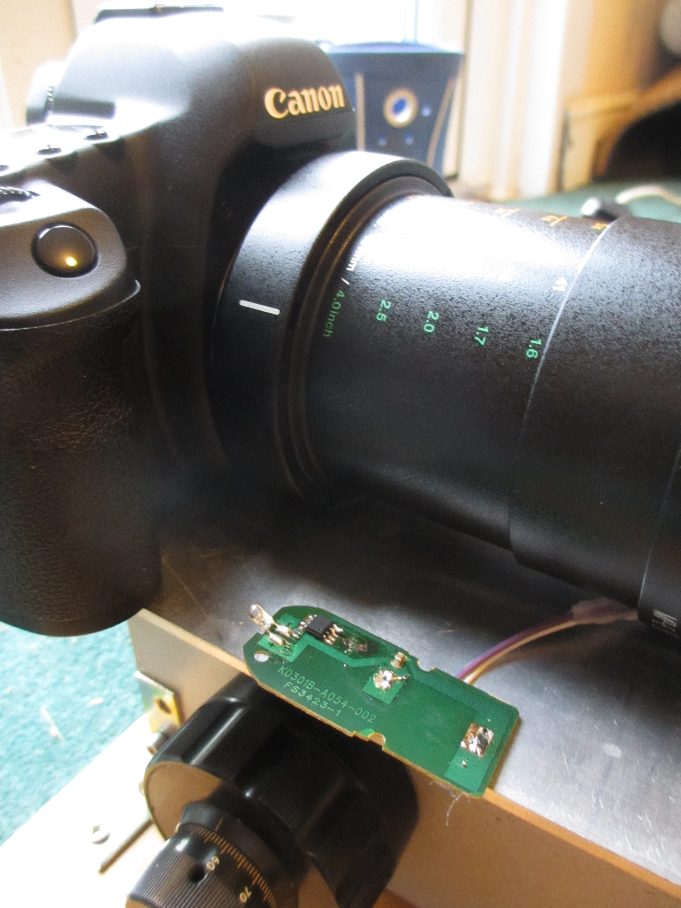

## Hardware

This section explains what hardware is required for an Arduino-driven system, and how it is all wired up. We are only covering the electronics here and the other hardware is discussed in the main page. 

### The full setup from several angles

This is the full setup from above. From top to bottom, the parts are the microscope block connected via cogs to the stepper motor. The stepper motor is then wired to a stepper motor shield, which is in turn wired to the Arduino at the bottom of the photo. 

This is the same setup from the side. From left to right, the parts are the Arduino, the stepper motor shield, the stepper motor, and then the cogs from the stepper motor to the microscope section on which the camera is mounted. 

Below, again, is the full setup, but shown from slightly above. 

### Wiring positions on the Arduino

The three images below show in detail where the jumper wires need to be connected. Further information about where these wires go is given in the following sections. 

#### Stepper motor shield to Arduino:

The stepper motor shield is shown in this image:

The wire connections from the top left corner of the stepper shield to the Arduino are as follows:

GND to GND 
STEP to Digital 2 
DIR to Digital 3

#### Stepper motor to stepper motor shield

The stepper motor has four wires which are all unlabelled. It took us some work to figure out which was which, so that we could connect them to the right places. Our four wires are blue, green, red and black. They are connected to the pairs of holes labelled "A" and "B" at the bottom centre of the shield as seen in the photo above.

#### Power cable to stepper motor

The stepper motor needs power to operate, and this is provided via the stepper motor shield. We used a 12V transforner plug, the wires of which are soldered directly onto the stepper motor shield. Those wires are the black wires visible in the bottom left part of the image above. They are soldered to GND and M+.

#### Infra red remote control:

The infra red remote control is wired up to the Arduino, so that the shot can be triggered automatically, after each forward movement of the camera. Each time the camera has moved forward, the Arduino triggers the infra red remote control bulb to light, causing the camera to take a shot. 

The photos below show the position of the remote control in the setup. 

The two images below show how the infra red camera trigger is wired up. Tim had to take the case right off and then soldered on wires, and firmly connected them using a hot glue gun. 

These wires are connected to the Arduino as follows:

Digital 13 to IR + terminal nearest bulb. 
GND to IR terminal furthest from bulb. 

### The cogs

Lastly, below is the set of cogs that allow the stepper motor to drive the microscope block. The cogs are fairly soft plastic and we just got them off the shelf in Maplin. We cut the insides out and they slid easily onto the microscope knob. 

## Code

<a href="arduino.c">This is the code</a> that we use to drive the system. All it does is to move the microscope block forward by some tiny amount (how ever far we tell it to go), and then it pauses for the system to settle and triggers the camera to take a shot. 

Once the code has been uploaded to the Arduino, it will keep running whenever the battery is plugged in. So when using thhis computer to drive the focus block, just start it by plugging in the battery and stop it by unplugging the battery. Any modification to the code, for example to change the step size, will require reattaching the arduino to the computer and modifying the code again. 

