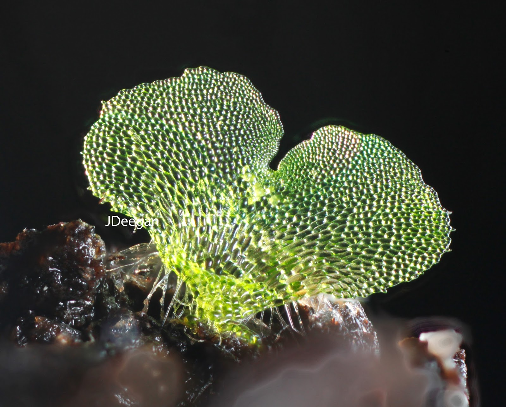
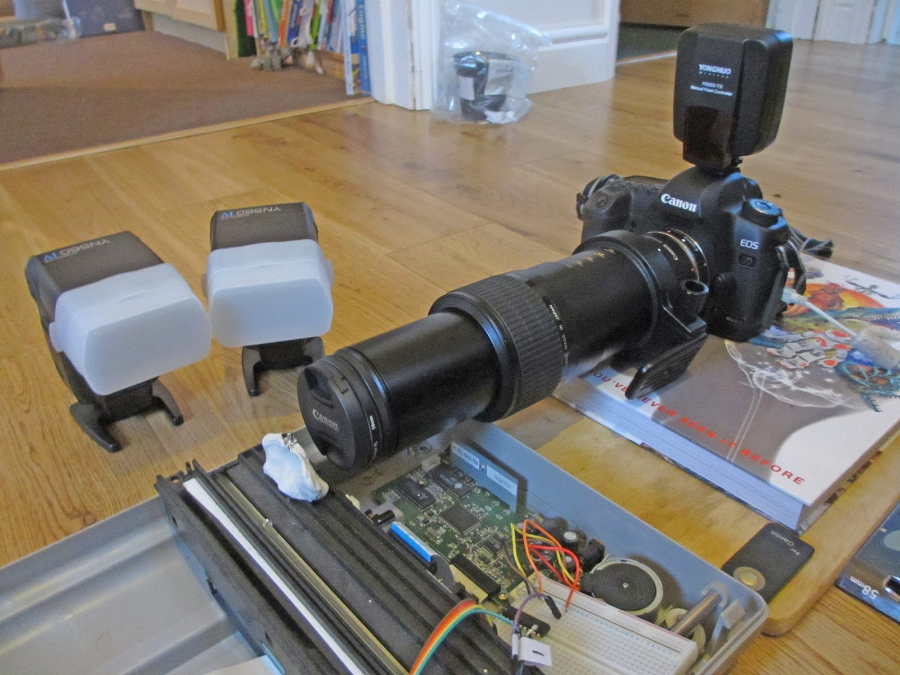
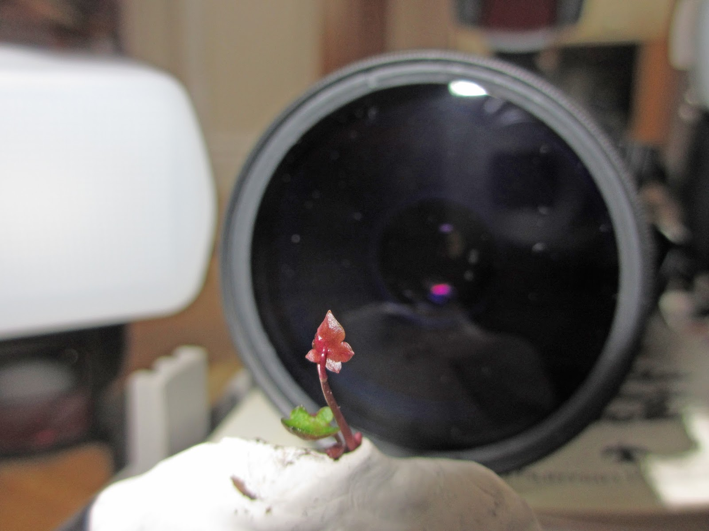

## Background to the project

This is a focus stacked photograph of a fern gametophyte. The subject is about 3mm tall. My project at the moment is to 
try to take a series of photos of fern gametophytes as they develop from a single cell, until the point when the first 
sporophyte leaf emerges. 

The photograph above was taken using a Canon DSLR with an MP-E 5x macro lens and 4cms of extension tubes, to increase
the magnification to about 10x.

With this setup, the depth of field of the image is tiny, so that only part of the fern is in focus as below. In order 
to have the entire subject in focus, I used a technique called focus stacking. 

 Focus stacking is a technique in which the subject is moved progressively toward the camera lens, with one photograph 
 being taken after each movement. 

In the case of this photograph, the movement was carried out by mounting the subject on the arm of a flatbed scanner 
with the arm providing the movement. The scanner arm was edged forward in minute steps under the control of a Raspberry 
Pi computer. The setup is shown below.  

 This close-up image below shows a larger specimen mounted on the arm of the scanner, as it works its way towards 
 the Canon lens. 

To create the fern photograph I took 40 photographs or slices. The photographs were amalgamated using software 
called Helicon Focus.

I have shown the photograph to some very experienced macro photographers in a forum online and they tell me that 
to get the image really sharp I should move up to using microscope objectives mounted on my camera, and ideally 
that I should build a rack and pinion mounting system with a stepper motor to control the movements of the camera 
relative to the subject. I've also to use cross-polarisation and more diffuse lighting. 

This system would cost about £4000 to build and so I am trying to apply for a grant to design and build such a 
system.

My hope would be to design and build something related to this Bratcam setup, but very much more cheaply, using scavenged parts:

Here's my current best image again as a reminder of what I am aiming to improve upon. 

