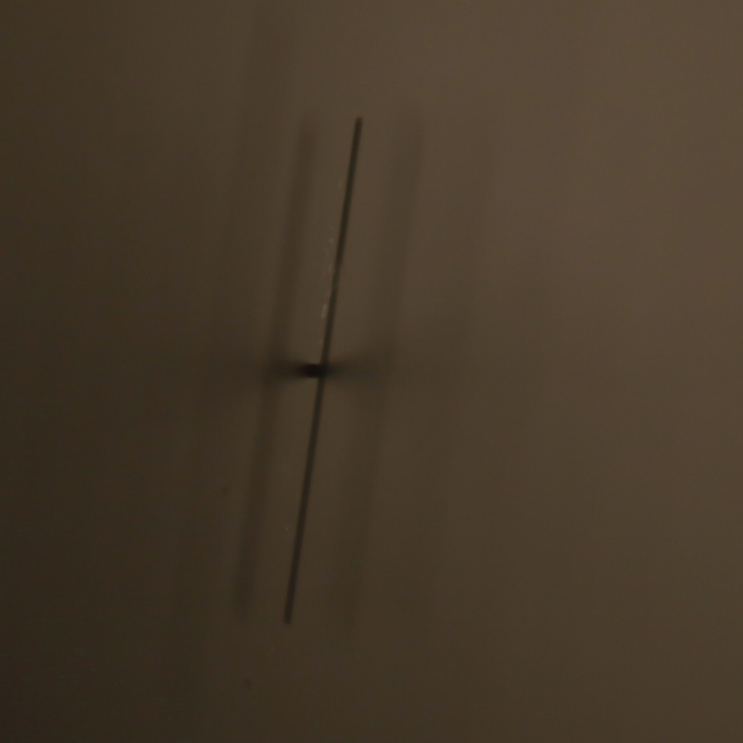

I used a stage micrometer to work out what the depth of field is in practice for my lenses. The scale is 1cm long and is marked in increments from 0 to 100. Here are photos from the MP-E and the Mitutoyo lens. 

This is the stage micrometer photographed with the MP-E on about x2 just to show what it looks like: 

 

This is the micrometer at x5 on the MP-E: 

 

This is the micrometer sitting almost parallel to the MP-E lens at x5, to measure the depth of field: 

 

This is the micrometer photographed with the Mitutoyo lens: 

 

This is the micrometer at 45 degrees to the Mitutoyo lens, image cropped. 

 

This is the micrometer at 90 degrees to the optical axis of the lens, also cropped. It shows that there is sharp focus, but that I need to be using slices taken at one or at most two micrometers apart.  

 
