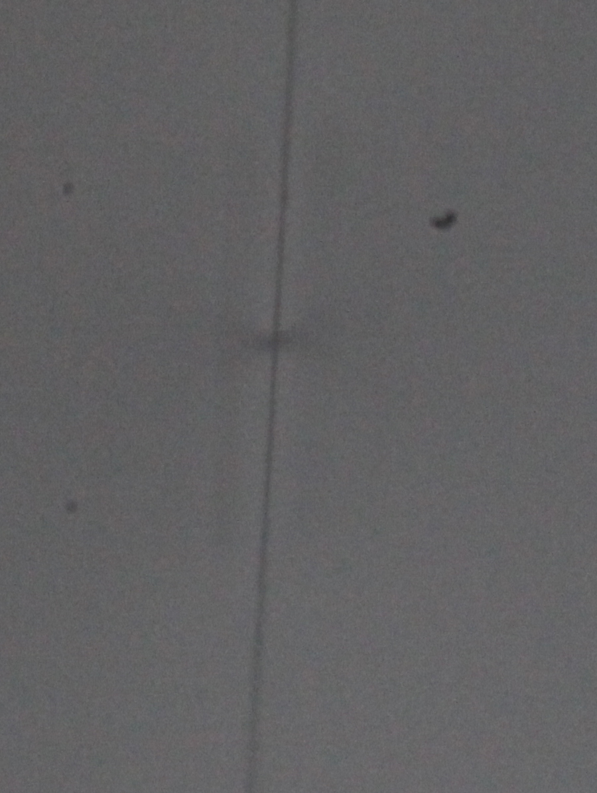

I used a stage micrometer to work out what the depth of field is in practice for my lenses. The scale is 1cm long and is marked in increments from 0 to 100. Here are photos from the MP-E and the Mitutoyo lens. 

This is the stage micrometer photographed with the MP-E on about x2 just to show what it looks like: 

 

This is the micrometer at x5 on the MP-E: 

 

This is the micrometer sitting almost parallel to the MP-E lens at x5, to measure the depth of field: 

 

This is the micrometer photographed with the Mitutoyo lens: 

 

This is the micrometer parallel to the Mitutoyo lens to measure the depth of field. 

 

This is a cropped version of the same. 

This is a another attempt at the same with the line carefully centred in the focussed area. 

It seems as though the depth of field of the Mitutoyo is about 5 micrometres. The depth of field of the MP-E seems to be a bit more than 10 micrometers. Oddly the Mitutoyo lens doesn't seem to be really well focussed at any depth. I need to think about that. 
