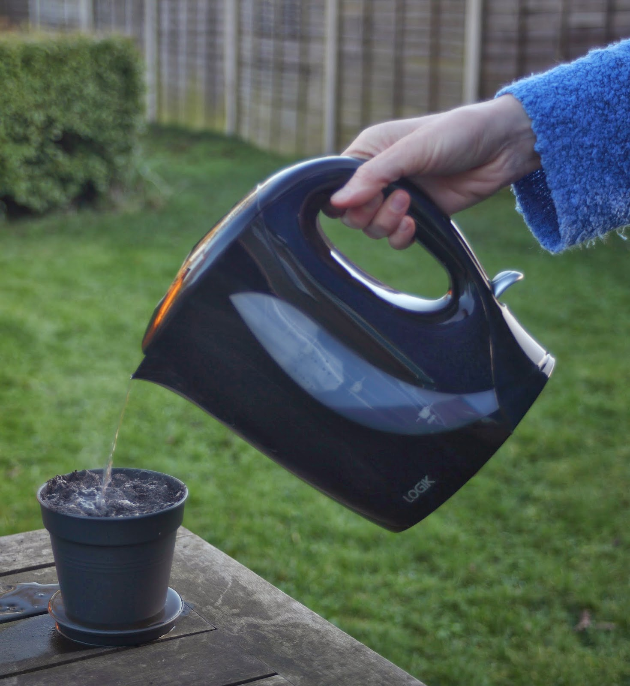
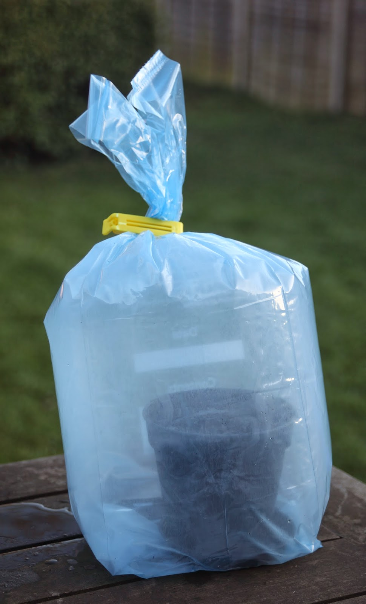

I am growing fern gametophytes on compost as follows:

1) Fill a completely clean plastic plant pot with peat-based compost (like Jack's Magic), leaving about 2 cms between the rim of the pot and the top of the soil. 

2) Pour a lot of boiling water through the compost to thoroughly sterilise it (Figure 1, below). 

3) Cover the pot with cling film or a freezer bag to exlude air-borne spores and leave to drain. 

4) Put the pot into a sealed freezer bag and then put into the fridge to cool. 

5) When cool, sow spores thinly on the surface of the compost and then reseal the freezer bag (Figure 2, below). Spores should be sown very thinly to get good photographic specimens. The best way that I have found is to have the spores on a piece of paper and then lightly flick the paper so that the spores shoot into the air and float down onto the compost. 

6) Put the pot near a window but not in a place where it will be exposed to direct sunlight. The pot should not be above normal room temperature. For example, an airing cupboard would be too hot. 

7) Germination takes several weeks, and there may still be problems with fungal contamination, so it is best to have several pots growing at once so that at least one pot is likely to be free of fungus. 

8) When the spores germinate the gametophytes will be extremely hard to see at first. They just look like tiny fragments of diamond dust with a green tint. 

Figure 1

Figure 2

