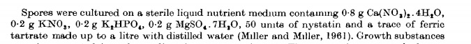

I am trying to grow fern gametophytes on agar plates using the same protocol as used in:

Photoresponses of Matteuccia struthiopteris (L. ) Todaro
I. GERMINATION  S. J. JARVIS  M. B. WILKINS
Journal of Experimental Botany, Volume 24, Issue 6, 1 December 1973, Pages 1149–1157, https://doi.org/10.1093/jxb/24.6.1149
Published: 01 December 1973

This is the actual protocol used, taken as an image from the publication:

I did not initially have the protocol and started with Gamborg + vitamins, and nystatin at three different concentrations, but this resulted in very rapid growth of bacterial colonies. The nystatin level required to stop fungal growth seemed to be 1mg of nystatin per litre of medium. I think that the ferric tartrate must be needed to stop bacterial growth. 

The protocol talks about liquid medium but I need to add agarose to make a solid substrate on which to grow photographic specimens. We are assuming 6g of agarose per 500ml medium. 

My next plan is to go back to the lab and try to follow the above protocol exactly but with the addition of agarose. I'm also tempted to try the Gamborg agarose that I have already made up, with ferric tartrate and nystatin added if there is any on the shelves. 
