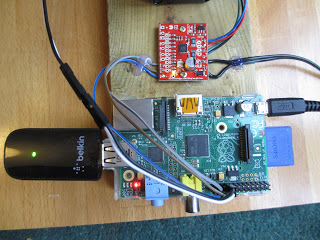

## Synopsis

This project is a collaboration between many people. The principles of the design came from the lovely folks at the http://www.photomacrography.net/ forum. The design is particularly based on the Bratcam, designed by Chris Slaybaugh. The focus block was given to me as a gift by one of the forum members (Doc.Al). The electronics and programming and some of the fitting together were done by my husband, Tim Deegan. I did everything else.

## Software

We provide instructions on how to drive the system using either an <a href="https://github.com/BioMakers/23_Focus-stacking-system-for-gametophyte-ferns/blob/master/ArduinoMethod.md">Arduino</a> or a <a href="https://github.com/BioMakers/23_Focus-stacking-system-for-gametophyte-ferns/blob/master/RaspberryPiMethod.md">Raspberry Pi</a>. Please see one or other of these pages for the software documentation depending on which hardware you are using. 

## Hardware

Here is the hardward setup. The focus block, on which the camera rests, is a block from a Nikon Optiphot or Labophot microscope. It was sawn out of the microscope by Doc.Al of the http://www.photomacrography.net/ forum. He also drilled holes in it, which have allowed me to fasten it to the board. The board is a piece of discarded kitchen worktop.

Below is a close-up shot of the camera with a Canon MP-E lens mounted on the block. You can see the focus knob under the camera. It allows the top section of the block to be moved back and forth. There is a coarse and fine focus knob. On the other side of the focus block there are identical focus knobs. 

Switching now to the other side - below, you can also see the stepper motor, and the gearing that allows it to drive the fine focus control. The driver board (red) and a Raspberry Pi are also shown. These allow us to control the stepper motor. 

The stepper motor is an RS Pro Hybrid Stepper Motor 0.9°, 44 Ncm, 2.8 V, 1.68 A, 4-wire motor, which was bought from http://uk.rs-online.com/. I intentionally brought quite a beefy motor in the hope that it would be less likely to burn out. It is also very square in the body, which helps to brace it against the board. 

Here is a close-up view of the gearing. The gear wheels were bought from http://www.maplin.co.uk/ and then the centres were drilled out or cut out with a hacksaw blade. The plastic gears were very soft, and easy to cut. 

Below in close-up is the driver board that allows the Raspberry pi to drive the stepper motor. The stepper motor is a 4-wire bipolar stepper motor, and requires and H-bridge chip to drive it. The board brought a number of specific advantages over just using an H-bridge and breadboard. The motor is able to turn a single complete turn of its spindle in 400 steps, but with the driver board this can be changed to 16 steps. The current reaching the motor can also be controlled so that the motor does not burn out. 

The system can be driven by a Raspberry Pi or an Arduino, and photographs of the two possible setups are shown below. 

INSERT ARDUINO PHOTO HERE.

Tim devised a system whereby the Raspberry Pi or Arduino could also send a signal to fire the shutter of the camera automatically. He took apart a 3rd-party infra red Canon camera remote control and wired it up to the Raspberry Pi terminals. This means that he can write a single python programme to operate the stepper motor, and fire the shutter of the camera alternately. We have tried this and it works well. 

Below is a photograph of the infra red remote control with its new wiring. 

This is the other side. The wires are attached firmly to the board using the glue from a hot glue gun. 

Tim has carried out some experiments on the travel that is produced in the focus block using this stepper motor setup. He figured out that a single step of the stepper motor moves the top part of the focus block 1/128th of a μm (micro metre), which is very very good for our purposes.The movement is very smooth indeed. 

## Arduino or Raspberry Pi

We provide instructions on how to build and drive the system using either an <a href="https://github.com/BioMakers/23_Focus-stacking-system-for-gametophyte-ferns/blob/master/ArduinoMethod.md">Arduino</a> or a <a href="https://github.com/BioMakers/23_Focus-stacking-system-for-gametophyte-ferns/blob/master/RaspberryPiMethod.md">Raspberry Pi</a>. 

## Installation, Maintenance and Testing Guide

Provide instructions on usage, describe a test scheme and show how to run the tests with code and hardware configuration examples with some representative results.

## License

A short snippet describing the license (MIT, Apache, etc.) you have chosen to use
