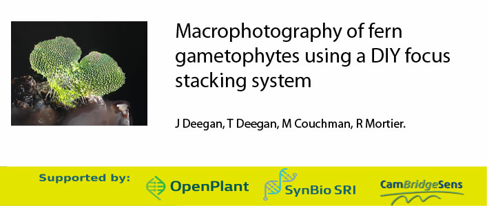
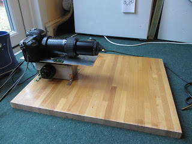
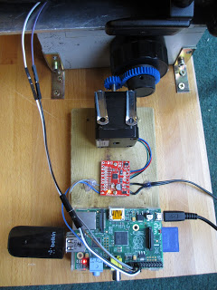
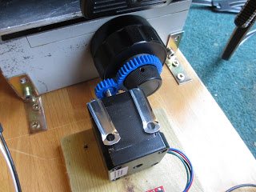
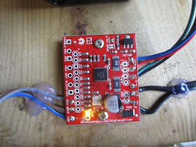

## Synopsis

This project is a collaboration between many people. The principles of the design came from the lovely folks at the http://www.photomacrography.net/ forum. The design is particularly based on the Bratcam, designed by Chris Slaybaugh. The focus block was given to me as a gift by one of the forum members (Doc.Al). The electronics and programming and some of the fitting together were done by my husband, Tim Deegan. I did everything else.

## Software

We provide instructions on how to drive the system using either an <a href="https://github.com/BioMakers/23_Focus-stacking-system-for-gametophyte-ferns/blob/master/ArduinoMethod.md">Arduino</a> or a <a href="https://github.com/BioMakers/23_Focus-stacking-system-for-gametophyte-ferns/blob/master/RaspberryPiMethod.md">Raspberry Pi</a>. Please see one or other of these pages for the software documentation depending on which hardware you are using. 

## Hardware

Here is the hardware setup. The focus block, on which the camera rests, is a block from a Nikon Optiphot or Labophot microscope. It was sawn out of the microscope by Doc.Al of the http://www.photomacrography.net/ forum. He also drilled holes in it, which have allowed me to fasten it to the board. The board is a piece of discarded kitchen worktop.

You can see the focus knob under the camera. It allows the top section of the block to be moved back and forth. There is a coarse and fine focus knob. On the other side of the focus block there are identical focus knobs. 

Switching now to the other side - below, you can also see the stepper motor, and the gearing that allows it to drive the fine focus control. The focusing can be driven by a Raspberry Pi or an Arduino, as shown in the two photographs below. The red board is a stepper motor shield. 

We provide instructions on how to drive the system using either an <a href="https://github.com/BioMakers/23_Focus-stacking-system-for-gametophyte-ferns/blob/master/ArduinoMethod.md">Arduino</a> or a <a href="https://github.com/BioMakers/23_Focus-stacking-system-for-gametophyte-ferns/blob/master/RaspberryPiMethod.md">Raspberry Pi</a>. Please see one or other of these pages for the wiring information, depending on which hardware you are using. 

Raspberry Pi setup:

Arduino setup:

The stepper motor is an RS Pro Hybrid Stepper Motor 0.9°, 44 Ncm, 2.8 V, 1.68 A, 4-wire motor, which was bought from http://uk.rs-online.com/. I intentionally brought quite a beefy motor in the hope that it would be less likely to burn out. It is also very square in the body, which helps to brace it against the board. 

Below is a close-up view of the gearing. The gear wheels were bought from http://www.maplin.co.uk/ and then the centres were drilled out or cut out with a hacksaw blade. The plastic gears were very soft, and easy to cut. 

Below, in close-up, is the driver board that allows the Raspberry Pi or Arduino to drive the stepper motor. The stepper motor is a 4-wire bipolar stepper motor, and requires an H-bridge chip to drive it. The board brought a number of specific advantages over just using an H-bridge and breadboard. The motor is able to turn a single complete turn of its spindle in 400 steps, but with the driver board this can be changed to 16 steps. The current reaching the motor can also be controlled so that the motor does not burn out. 

Tim devised a system whereby the Raspberry Pi or Arduino could also send a signal to fire the shutter of the camera automatically. He took apart a 3rd-party infra red Canon camera remote control and wired it up to the Raspberry Pi or Arduino terminals. This meant that he could write a single programme to operate the stepper motor, and fire the shutter of the camera alternately. We have tried this and it works well. 

Below is a photograph of the infra red remote control with its new wiring. 

This is the other side. The wires are attached firmly to the board using the glue from a hot glue gun. 

Tim has carried out some experiments on the travel that is produced in the focus block using this stepper motor setup. He figured out that a single step of the stepper motor moves the top part of the focus block 1/128th of a μm (micro metre), which is very very good for our purposes.The movement is very smooth indeed. 

## List of Hardware Bits for the Rail

Bit of discarded worktop (£0) 
Bit of sawn off Nikon Optiphot or Labophot microscope (£0 this time, but I was very lucky) 
Cogs from Maplin (about £15) 
Screws (£1 MacKays hardware shop in Cambridge) 
Sheet of metal (£1.37 from MacKays hardware shop in Cambridge) 
Raspberry Pi B (£34.50) or Arduino Uno (£17.30) 
Canon Remote Control RC-06 (£16.99) or amazon version (£6.99) 
Jumper wires 
12v power supply transformer plug to drive motor via Raspberry Pi or Arduino.  
"<a href="https://www.coolcomponents.co.uk/en/big-easy-driver.html?gclid=Cj0KCQjwlMXMBRC1ARIsAKKGuwi1l4njTmxLjw_-HU0Y6a0uq0VRKntCE-Y4QuHq51zZWsJd3BriBewaAuWZEALw_wcB">Big Easy Driver</a>" Stepper motor control board with voltage adjustment (£22) 
<a href="http://uk.rs-online.com/web/p/stepper-motors/5350401/">RS Pro Hybrid Stepper Motor</a> 0.9°, 44Ncm, 2.8 V, 1.68 A, 4 Wires (£27.17) 
Soldering equipment 
Hot glue gun

### Arduino version also requires:

USB cable to connect to laptop

### Raspberry Pi version also requires:

SD card 
Wireless dongle 

## Hardware bits for the optics. 

This can vary a bit, but here is what I am using:

Canon 5d MkII camera body (£1200 several years ago from DigitalRev) 
Olympus Zuiko 200mm prime lens (available used only, as it is about 30 years old - about £70 on ebay) 
M26X0.706 Mitutoyo microscope female thread to M55mm 55X0.75 adapter micrography (£11.48 on ebay) 
10X Mitutoyo Plan Apo Infinity Corrected Long WD Objective (From Mitutoyo: £677.16)

## Other bits

I stand my fern specimens on a bit of blutac on top of a paint pot.  
The lens of the camera needs to be slightly propped up to be horizontal and I do that by putting the shaft of a screwdriver under it sideways. It looks a bit rough and ready, but it works really well, as it is effectively a very slightly inclined wedge so can be adjusted in very slight increments to get exactly the right angle for the lens. 

## Installation, Maintenance and Testing Guide

Provide instructions on usage, describe a test scheme and show how to run the tests with code and hardware configuration examples with some representative results.

## License

A short snippet describing the license (MIT, Apache, etc.) you have chosen to use
