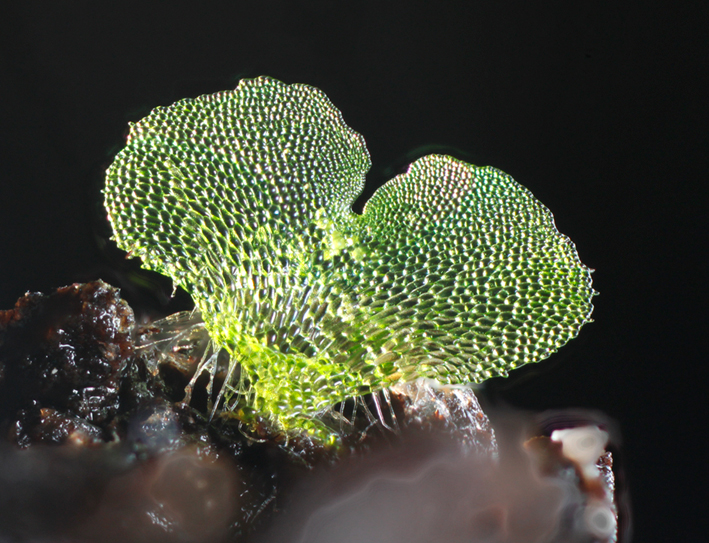
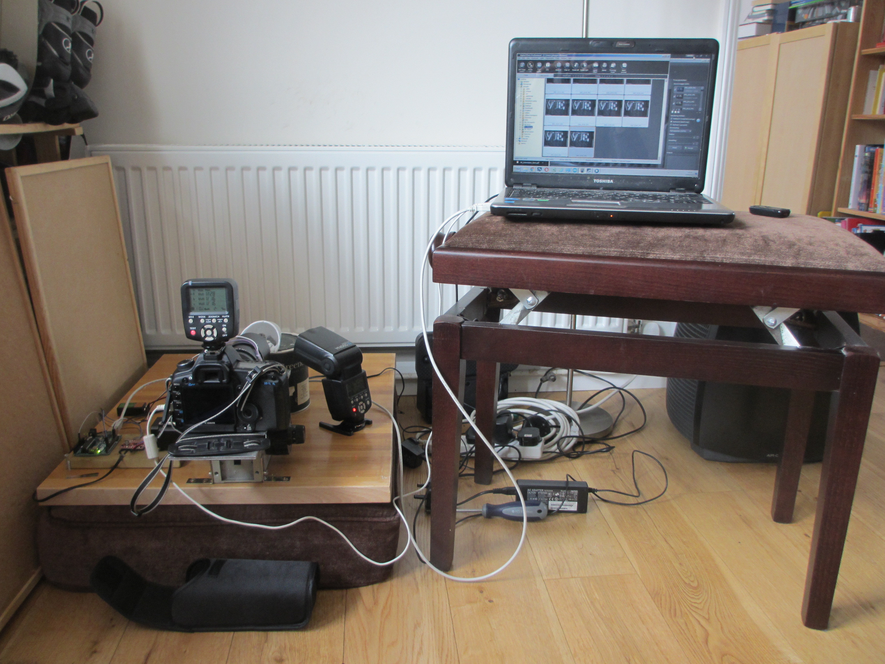
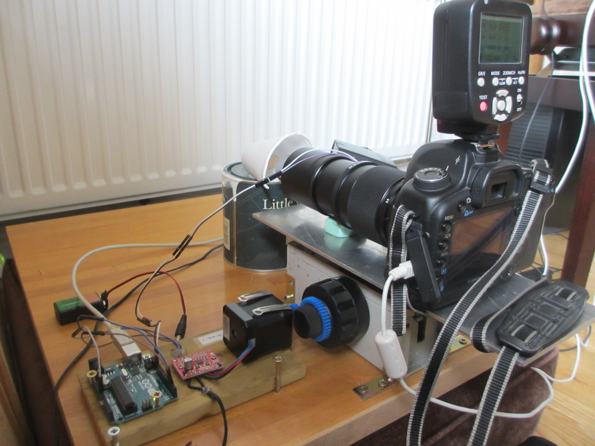
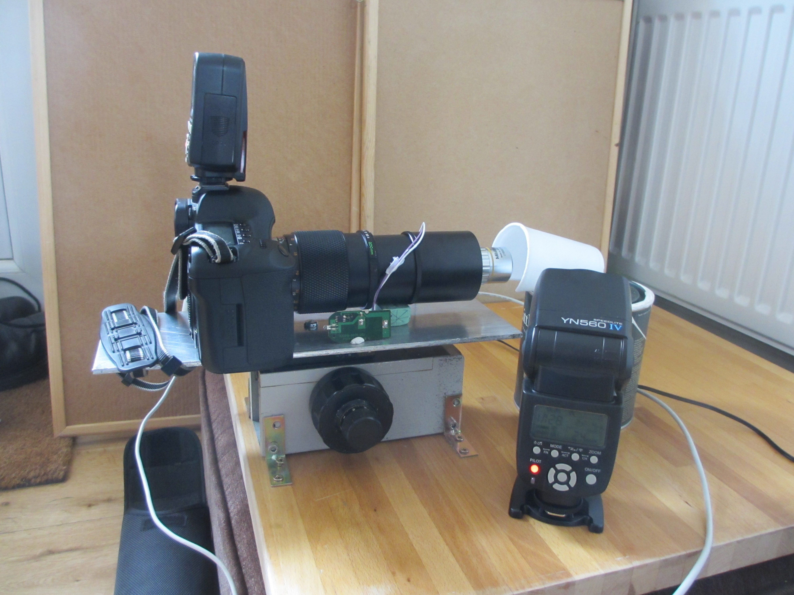

Jennifer Deegan 

Tim Deegan 

<Richard Mortier>

## Synopsis

The aim of this project is to home-build a microscope capable of photographing gametophyte ferns. The style of photography aims to produce attractive images of the sort that might normally be seen on the front of Gardeners' World Magazine, or similar. 

The technique to be used is called focus stacking and Jennifer Deegan has already worked extensively on developing a system. She has taken a fairly good photograph of a gametophyte fern, using a <a href="https://github.com/BioMakers/23_Focus-stacking-system-for-gametophyte-ferns/blob/master/Background.md">set up that relies on a modified flatbed scanner</a> (image below). For a full understanding of focus stacking please refer to the <a href="https://github.com/BioMakers/23_Focus-stacking-system-for-gametophyte-ferns/blob/master/Background.md">flatbed scanner introduction page</a>. The aim of this current project is to significantly improve on that first image. 

This project is a collaboration between many people. The principles of the design came from the forum members at  http://www.photomacrography.net/. The design is particularly based on the Bratcam, by Chris Slaybaugh. The focus block was provided as a gift by one of the forum members (Doc.Al). Some of the electronics and programming, and some of the fitting together were carried out by Tim Deegan. He also helped with the principles of the design. Jennifer Deegan did everything else.

## Hardware

There is a lot of complex hardware involved in this project, so a structured introduction is given on this page, and each section references another page, on which details of that part are given. 

The following is an image of the full photographic setup including the optics, electronics and laptop:

This is the setup including just the optics and electronics:

This picture shows the optics:

### Rail Hardware

The <a href="https://github.com/BioMakers/23_Focus-stacking-system-for-gametophyte-ferns/blob/master/rail.md"> hardware for the rail</a> is one of the most critical parts, as this gives very fine control over the movement of the camera, and underpins the quality of the slices from which the stack is derived.  

### Hardware for the optics. 

The quality of the <a href="https://github.com/BioMakers/23_Focus-stacking-system-for-gametophyte-ferns/blob/master/optics.md"> optics</a> is critical, as this determines the quality of the slices from which the final stacked image is derived. 

### Hardware for the lighting. 

Effective <a href="https://github.com/BioMakers/23_Focus-stacking-system-for-gametophyte-ferns/blob/master/lighting.md">lighting</a> of gametophyte ferns for macrophotography is very tricky. These subjects are translucent and tend to produce specular highlights when the cells reflect the light of a camera flash, or create diffuse white lighting across the whole image. We have attempted to mitigate these issues using the techniques described. 

### Hardware to minimise vibration

<a href="https://github.com/BioMakers/23_Focus-stacking-system-for-gametophyte-ferns/blob/master/vibration.md">Vibration</a> is an important factor in photography at this tiny scale, so we used specific methods and hardware to control it.

### Other hardware

Fern specimens are mounted on a piece of blutac on top of a paint pot. The lens of the camera needs to be slightly propped up to be horizontal and this is done by putting a pencil eraser under it. 

## Software

There is a lot of software involved in this project. Some was bought, and some was written by Jennifer and Tim Deegan. 

### In-house software

Software was written in-house to drive the rail. We provide instructions on how to drive the rail system using either an <a href="https://github.com/BioMakers/23_Focus-stacking-system-for-gametophyte-ferns/blob/master/ArduinoMethod.md">Arduino</a> or a <a href="https://github.com/BioMakers/23_Focus-stacking-system-for-gametophyte-ferns/blob/master/RaspberryPiMethod.md">Raspberry Pi</a>. Please see one or other of these pages for the software documentation depending on which hardware you are using. 

### Bought software

The following pieces of commercial software were used:

Helicon focus for stacking the images 
EOS Remote for focussing the camera and figuring out the camara settings.  
Adobe photoshop. 

## Growing ferns

Growing the photographic specimens is one of the trickiest parts of this project. The <a href="https://github.com/BioMakers/23_Focus-stacking-system-for-gametophyte-ferns/blob/master/GrowingFerns.md"> protocol</a> that I am using is described. 

## Installation, Maintenance and Testing Guide

a <a href="https://github.com/BioMakers/23_Focus-stacking-system-for-gametophyte-ferns/blob/master/Test.md"> guide to testing</a> is provided. 

## License

I have no idea what to write here. 
