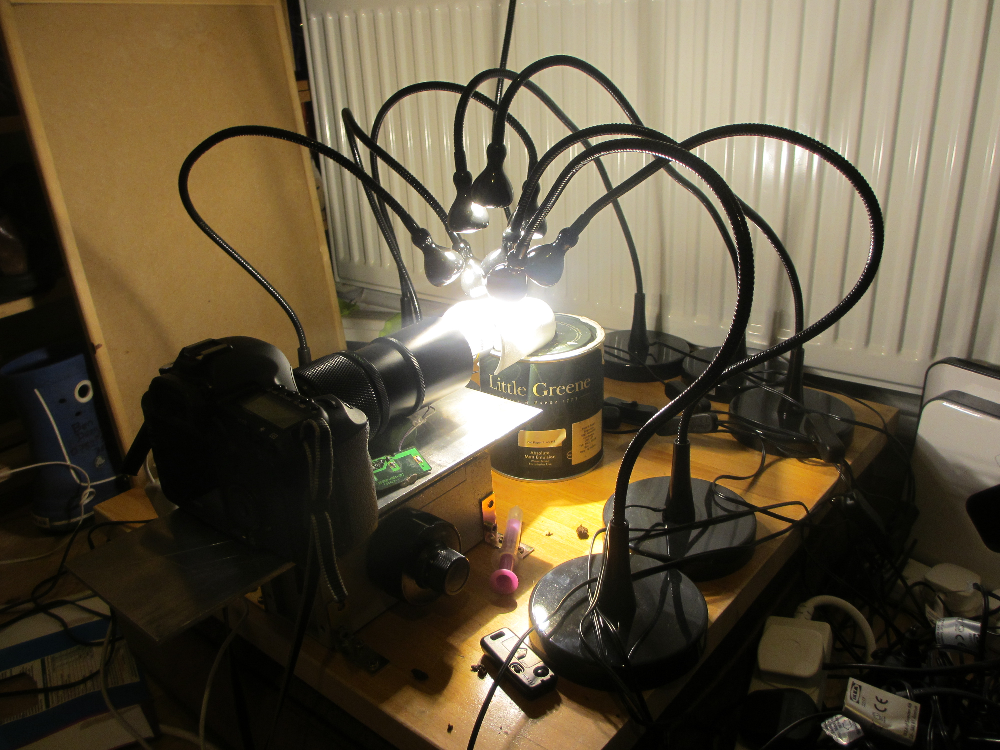
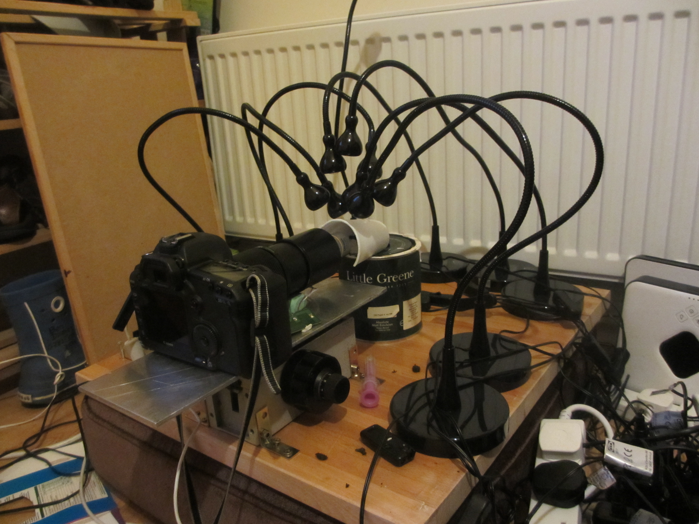

The rig can be lit with natural light if long exposures are to be used. ALternatively it can be used with with flashes or LED lamps, for shorter exposures that will stop any movement in the rig. My lighting equipment is as follows:

Yongnuo YN-560 IV Flash Speedlite x3 
Yongnuo YN560-TX Trigger - Wireless flash controller 
14 x AA rechargeable batteries 
A polystyrene cup to use as a diffuser. These are hard to come by now, but can be bought from ebay in sets of 25.

or

10 x IKEA LED Jansjo lamps. 
A polystyrene cup to use as a diffuser. 
Three extension leads to provide enough sockets to power the lights. 

## Flash lighting or LED lighting. 

I have tried both flash and LED lighting and both tend to cause the fern cells to shrivel up, and the whole fern structure to repidly collapse. As far as I can tell, the key is to use whichever setup is quickest for the operator to deal with, and that may be personal preference. The LED lamps are handy for setting up composition, but the flashes have the advantage of being turned off then no photo is being taken. 

The most important thing seemed to be to do the whole setup very quickly after the fern was removed from the pot, and have the set of photos taken very quickly. This means using short exposures, moving the rail as quickly as possible and leaving very littly settling time in between shots. We have an adapted arduino program that moves the rail very rapidly to avoild stressing the fern for too long. 

## Flash lighting

I found that 2 flashes were enough to light ferns for 1/160th exposure. Any faster than this and the curtain speed of the camera starts to show up as black lines at the bottom of the image. 

Here are some photos of the setup, including the settings required to make the flashes respond to control from the camera. 

Placement of the flash (for two flashes, the other was place directly opposite the first)

Positioning of the controller on the hotshoe:

Settings on the flash:

Settings on the remote controller on the hotshoe:

This is the polystyrene cup that diffuses the light to give the impression of a bright, naturally lit sky above the fern. This bright sky helps to avoid specular highlight on the lens-like cells of the fern. 

## LED lighting 

I also took photos using an LED lighting setup. These lights provide continous lighting so I have to constantly turn them on and off at the wall switch to stop them from over heating the fern. They also made a big tangle of cables and made access to the fern tricky. They were handy for setting up the composition of the shot though. 

