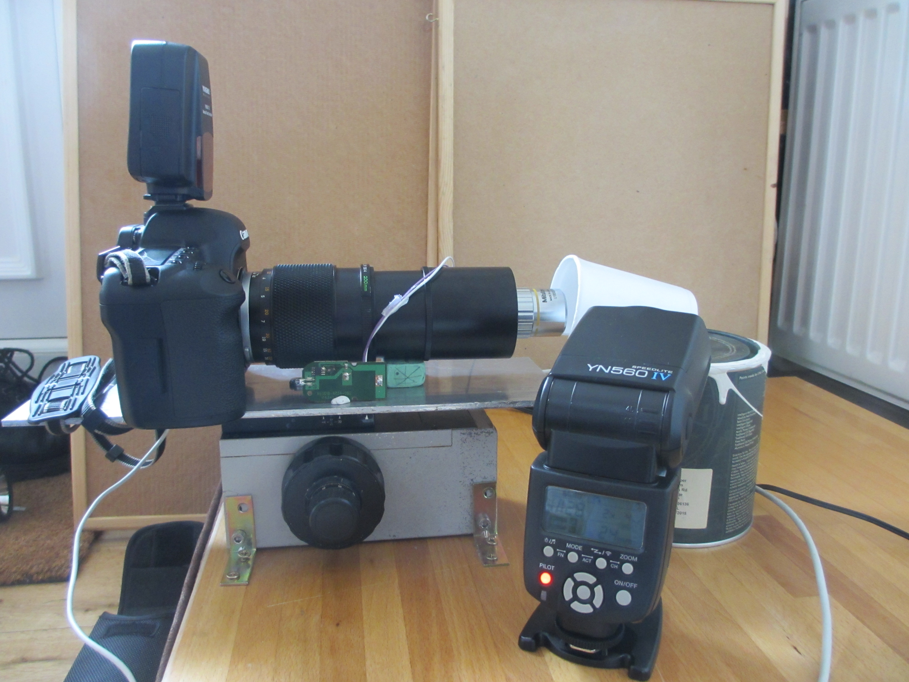
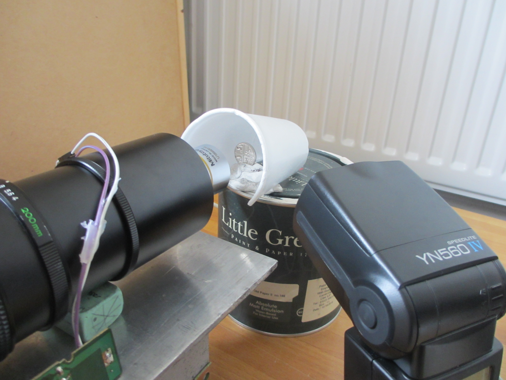
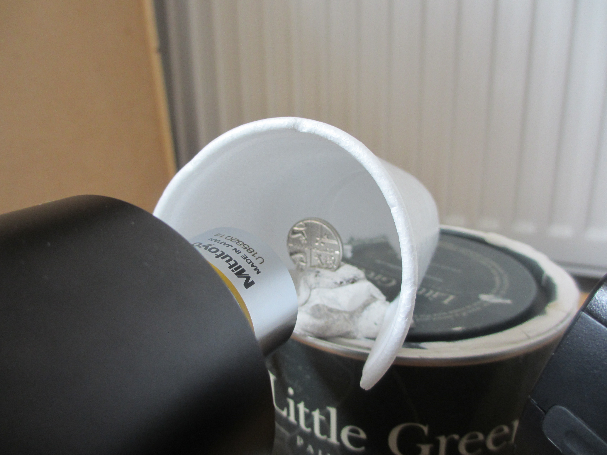

The rig can be lit with natural light if long exposures are to be used, or with flashes, for shorter exposures that will stop any movement in the rig. My lighting equipment is as follows:

Yongnuo YN-560 IV Flash Speedlite x3 
Yongnuo YN560-TX Trigger - Wireless flash controller 
14 x AA rechargeable batteries 
A polystyrene cup to use as a diffuser. These are hard to come by now, but can be bought from ebay in sets of 25.

I found that 2 flashes were enough to light ferns for 1/160th exposure. Any faster than this and the curtain speed of the camera starts to show up as black lines at the bottom of the image. 

Here are some photos of the setup, including the settings required to make the flashes respond to control from the camera. 

Placement of the flash (for two flashes, the other was place directly opposite the first)

Positioning of the controller on the hotshoe:

Settings on the flash:

Settings on the remote controller on the hotshoe:

This is the polystyrene cup that diffuses the light to give the impression of a bright, naturally lit sky above the fern. This bright sky helps to avoid specular highlight on the lens-like cells of the fern. 

