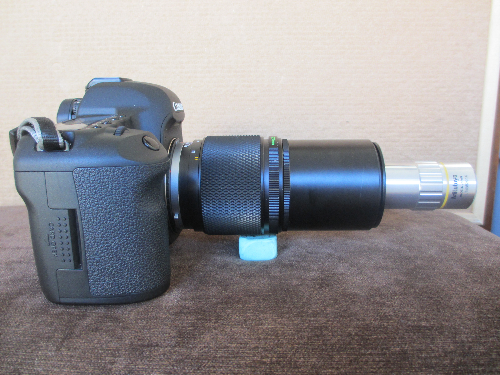
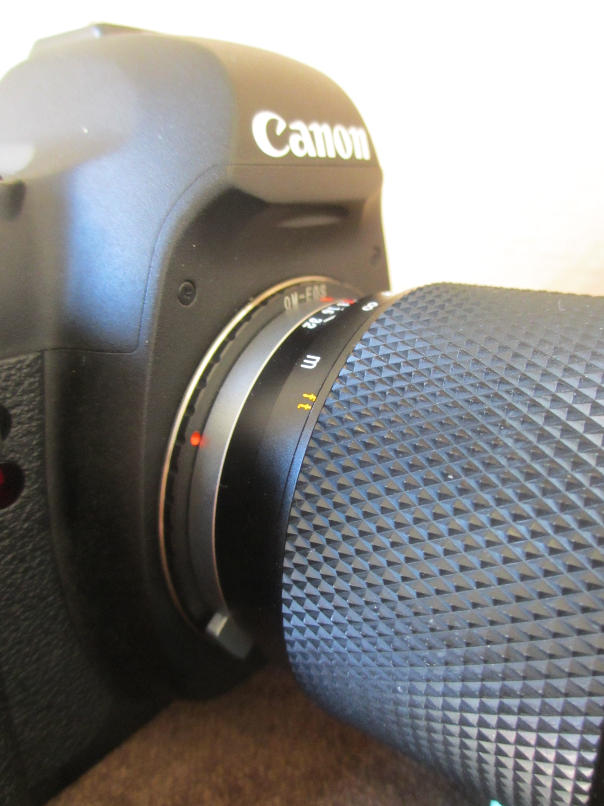
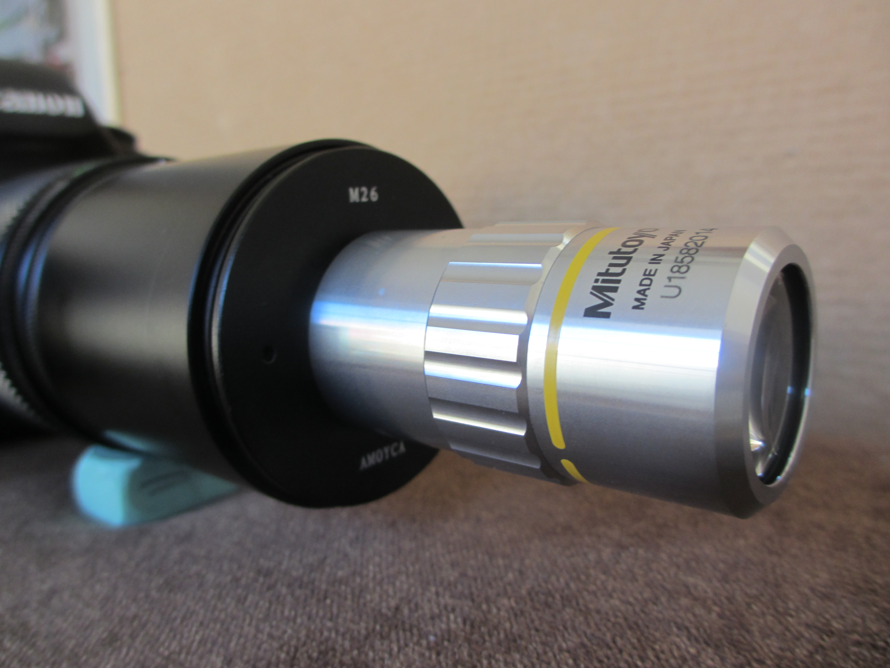

## Hardware for the optics

Canon 5d MkII camera body (£1200 several years ago from DigitalRev) 
Olympus Zuiko 200mm prime lens (available used only, as it is about 30 years old - about £70 on ebay) 
Lens Mount Adapter for Olympus OM Lens to Canon EF-Mount (about £20) 
M26X0.706 Mitutoyo microscope female thread to M55mm 55X0.75 adapter micrography (£11.48 on ebay) 
Two UV filters (55mm) with the glass removed as an extension to accommodate the long thread of the objective. 
10X Mitutoyo Plan Apo Infinity Corrected Long WD Objective (From Mitutoyo: £677.16) 
Canon MP-E lens for magnifications under x5.

This image shows the camera setup with the Canon MP-E lens for 1x to 5x magnification:

This image shows the camera setup with the Mitutoyo 10 microscope objective for 10x magnification. The objective was the major item that was bought with the money from the Biomaker grant. It has a long working distance (about 3.5cm) which is very useful for lighting and for minimising variation between the images that would make merging difficult. 

The objective is mounted on an Olympus Zuiko 200mm prime lens.

This image shows the adapter that connects the Olympus lens to the Canon camera.

This image shows the objective in close-up and the adapter that connects the Mitutoyo objective to the Olympus screw-fit connector. 

