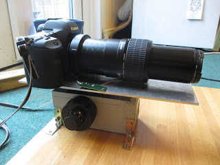

## Hardward for the optics

Canon 5d MkII camera body (£1200 several years ago from DigitalRev) 
Olympus Zuiko 200mm prime lens (available used only, as it is about 30 years old - about £70 on ebay) 
M26X0.706 Mitutoyo microscope female thread to M55mm 55X0.75 adapter micrography (£11.48 on ebay) 
10X Mitutoyo Plan Apo Infinity Corrected Long WD Objective (From Mitutoyo: £677.16) 
Canon MP_E lens for magnifications under x5.

