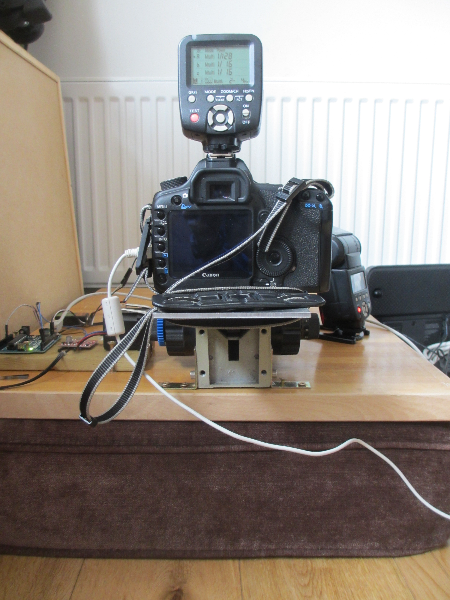

In macrophotography at this scale it is essential to minimise vibration. I did this by controlling the camera remotely from the laptop and setting it up so that the shutter would not move when a photograph was taken. I also put the entire assembly on a couch cushion so that if there was any vibration at all, then the entire assembly would move together, rather than the photographic subject and the camera moving independently of one another. This was suggested to me by members of the online discussion forum http://www.photomacrography.net/.

Here is a photograph of the cushioning system:

